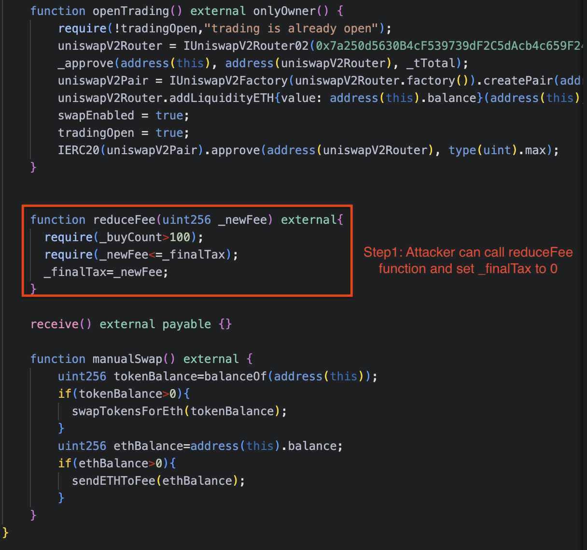
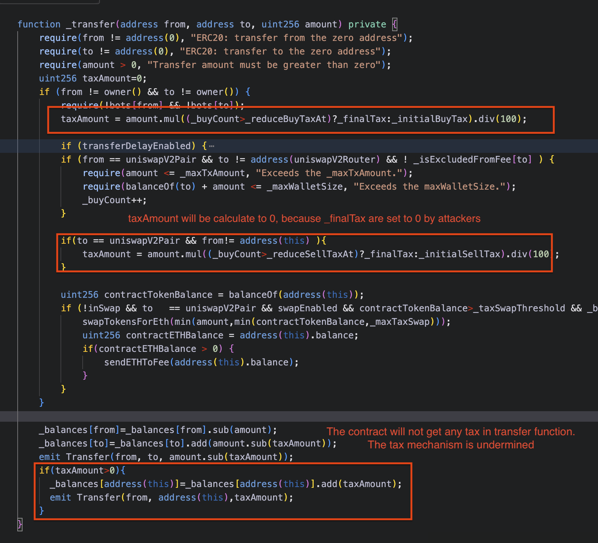

# EOTT
## Address
https://etherscan.io/address/0x5fe0971167215aade651f76492f8489e43ceb48a#code

## Vulnerability Description

The contract employs a tax mechanism within its _transfer function, where each transaction is subject to a tax, calculated as a percentage of the transfer amount. The tax rate is initially set higher for early buy and sell actions, gradually reducing as _buyCount increases beyond specified thresholds (_reduceBuyTaxAt and _reduceSellTaxAt). This mechanism helps maintain balance in transactions by applying higher tax rates at the start and then decreasing over time to a defined _finalTax rate, ensuring the contract collects taxes effectively.

However, the reduceFee function, which is publicly accessible without any authorization checks, allows any caller to modify the _finalTax rate, even setting it to zero if _buyCount exceeds 100. This bypasses the intended gradual reduction of taxes and undermines the integrity of the tax mechanism by enabling anyone to reduce the tax to an arbitrarily low value. By doing so, an attacker can effectively nullify the contract’s tax enforcement, allowing transactions to be executed without contributing to the contract’s tax balance, which could severely impact its intended functionality and fund collection.


## Vulnerability Code
```solidity
// reduceFee function should be protected by owner of the contract
function reduceFee(uint256 _newFee) external{
      require(_buyCount>100);
      require(_newFee<=_finalTax);
      _finalTax=_newFee;
    }
```

## Exploit
### Step1: call reduceFee function

### Step2: call transfer function 


