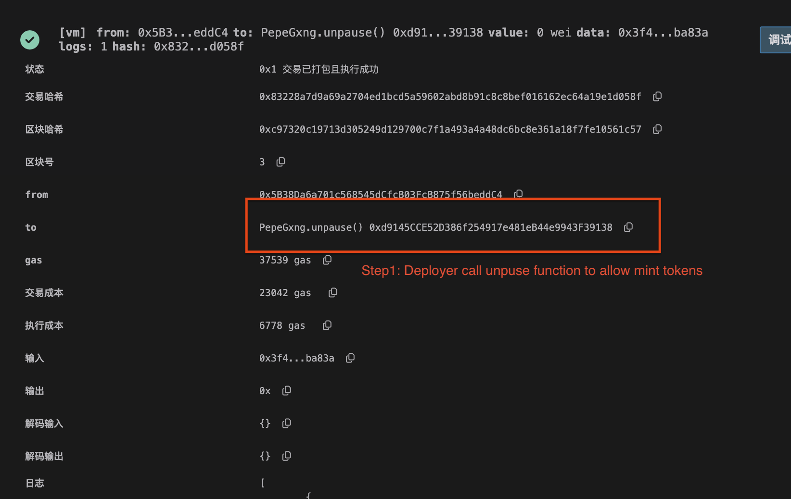
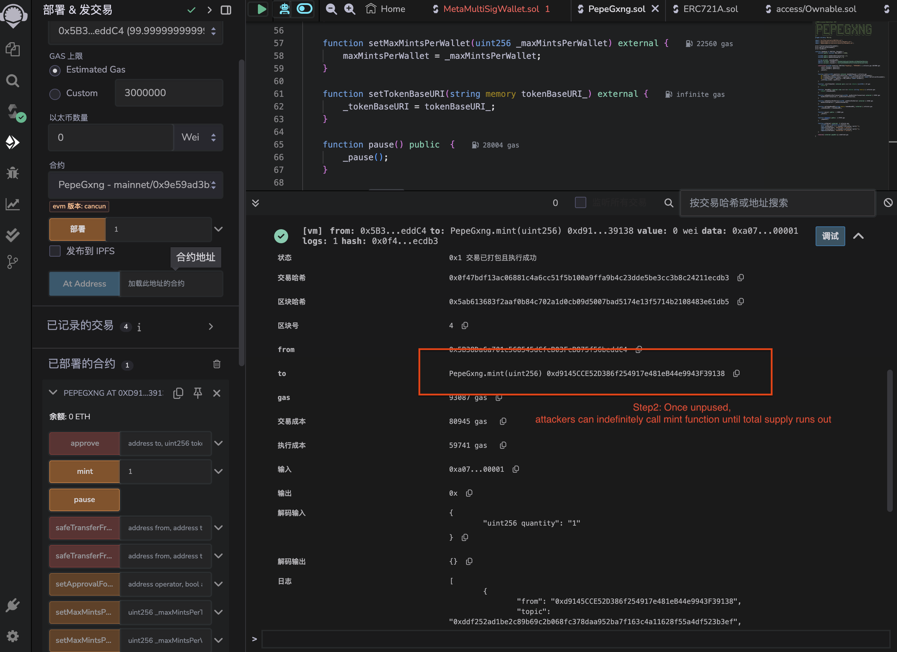

# PepeGxng
## Address
https://etherscan.io/address/0x9e59ad3b2962d5c62165133cfb4d899b990b01ec#code

## Vulnerability Description

The mint function in this contract allows users to mint new tokens when the contract is unpaused. It accepts a quantity parameter that specifies the number of tokens a user wishes to mint. However, the function lacks sufficient access control and is designated as external, meaning any user can call it once the contract is unpaused. This lack of restriction can lead to a vulnerability where attackers could call the mint function multiple times until the total supply of tokens (MAX_SUPPLY) is exhausted. Since the function does not enforce any checks beyond individual transaction and wallet limits, a determined attacker could use multiple addresses or bypass limits to effectively mint all tokens, leaving no supply for legitimate users.


## Vulnerability Code
```solidity
    function mint(uint256 quantity) external whenNotPaused {
        if (quantity > maxMintsPerTransaction) revert TransactionLimitExceeded();
        if (_numberMinted(msg.sender) + quantity > maxMintsPerWallet) revert WalletLimitExceeded();
        if (_totalMinted() + quantity > MAX_SUPPLY) revert SoldOut();
        _mint(msg.sender, quantity);
    }
```


## Exploit
### Step1: owner call unpause function

### Step2: attackers call mint function until all supplies run out


